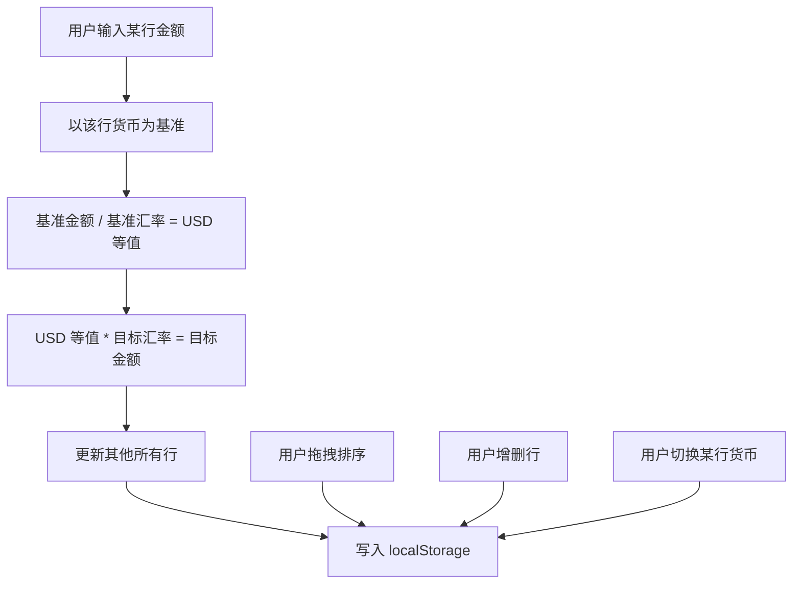

## 1. 产品概述

多货币实时换算计算器：用户在多行货币输入框中输入任意一行的金额，其余行基于 USD 交叉汇率自动换算联动。支持货币拖拽排序、增删行、本地持久化，覆盖 170+ 种 ISO 4217 货币。
- 目标用户：需要快速进行多币种金额对照的旅行者、跨境工作者、金融从业者
- 解决问题：替代单次单行的传统换算器，一次性呈现多币种对照视图

## 2. 核心功能

### 2.2 功能模块
1. **主页面（单页应用）**：货币行列表、货币选择器、汇率数据加载与联动换算

### 2.3 页面详情
| 页面名称 | 模块名称 | 功能描述 |
|-----------|-------------|---------------------|
| 主页面 | Header | 标题「Currency Converter」，无 logo、无副标题 |
| 主页面 | 货币行列表 | 多行卡片，每行 = 拖拽手柄（桌面）+ 货币选择器 + 金额输入框 + 删除按钮 |
| 主页面 | 货币选择器 | 自定义下拉，支持搜索；分组「常用 / 其他」；已添加货币禁用；三级响应式展示 |
| 主页面 | 添加行按钮 | 在列表底部，从可用货币中追加新行 |
| 主页面 | 换算联动 | 修改任意一行金额，以该行为基准，通过 USD 交叉汇率换算其他行 |
| 主页面 | 本地持久化 | 行配置（货币代码顺序）+ 金额写入 localStorage |

## 3. 核心流程

用户首次进入 → 默认加载若干常用货币行（USD 基准 + 几个常用币）→ 用户在某行输入金额 → 以该行货币为基准，按 USD 交叉汇率换算所有其他行 → 用户可拖拽排序、增删行、切换某行货币 → 所有变更实时写入 localStorage。

## 4. 用户界面设计

### 4.1 设计风格
- 主色：强调色靛蓝 `#4f46e5`；背景浅灰 `#f5f5f7`；卡片纯白
- 圆角：统一 6px（`rounded-md`），无阴影
- 字体：Fraunces（标题）/ DM Sans（正文）/ IBM Plex Mono（数字）
- 按钮：扁平、无 3D、靛蓝主操作按钮
- 布局：单列居中卡片，最大宽度约 720px
- 图标：仅拖拽手柄与删除使用极简 SVG/字符，无 logo

### 4.2 页面设计概览
| 页面名称 | 模块名称 | UI 元素 |
|-----------|-------------|-------------|
| 主页面 | Header | Fraunces 标题居中，靛蓝强调 |
| 主页面 | 货币行 | 白色卡片内单行布局：⠿ 手柄｜选择器｜金额输入（右对齐 Mono）｜✕ 删除 |
| 主页面 | 货币选择器触发 | 三级响应式：手机仅代码+箭头；平板 国旗+代码+符号；桌面 全显示含中文名 |
| 主页面 | 货币选择器下拉 | 顶部搜索框；常用/其他分组分隔线；已添加项置灰禁用；国旗 emoji + 代码 + 中文名 + 符号 |
| 主页面 | 添加行按钮 | 靛蓝描边/填充，全宽或居中 |

### 4.3 响应式
- 桌面优先（≥768px）：显示拖拽手柄，全字段货币选择器
- 平板（640–767px）：隐藏拖拽手柄，选择器显示国旗+代码+符号
- 手机（<640px）：行间距缩小，选择器仅代码+箭头，确保金额输入框完整可见不被挤压

### 4.4 不要包含的元素
- 不加 logo 图标
- 不加副标题描述
- 不加底部说明区域
- 不加每行下方的「1 USD = xxx」提示
