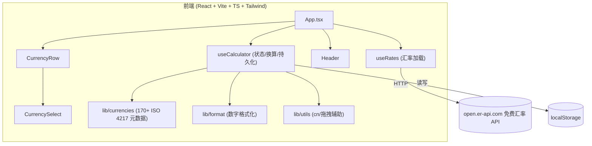

## 1. 架构设计



## 2. 技术说明
- 前端：React 18 + TypeScript + Vite + Tailwind CSS 3
- 初始化工具：`npm create vite@latest . -- --template react-ts`，再装 `tailwindcss postcss autoprefixer`
- 后端：无
- 数据库：无（仅 localStorage）
- 汇率数据源：`https://open.er-api.com/v6/latest/USD`（免费、无需 key、支持 CORS），返回 `rates` 为各货币对 1 USD 的汇率
- 字体：通过 Google Fonts 引入 Fraunces / DM Sans / IBM Plex Mono

## 3. 路由定义
| 路由 | 用途 |
|-------|---------|
| `/` | 单页主应用，包含 Header + 货币行列表 + 添加按钮 |

## 4. 数据模型与类型定义

```typescript
// lib/currencies.ts
export interface CurrencyMeta {
  code: string;          // ISO 4217 代码，如 "USD"
  name: string;          // 中文名，如 "美元"
  symbol: string;        // 货币符号，如 "$"
  flag: string;          // 国旗 emoji，如 "🇺🇸"
  common?: boolean;      // 是否常用货币（用于分组）
}

// hooks/useCalculator.ts
export interface Row {
  id: string;            // 行唯一 id（uuid 或递增）
  code: string;          // 货币代码
  amount: string;        // 金额字符串（保留用户输入原样，便于编辑）
}

export interface CalculatorState {
  rows: Row[];
  baseId: string;        // 当前作为换算基准的行 id
}
```

## 5. 关键算法：USD 交叉汇率换算

设 `rates[code]` 为 1 USD = `rates[code]` 单位货币。

- 当用户修改行 `r` 的金额 `a`：
  - `usd = a / rates[r.code]`
  - 对其他每行 `t`：`newAmount = usd * rates[t.code]`
- 汇率缺失时回退为 1（避免 NaN），并在 UI 上隐式跳过该行更新。

## 6. 文件结构

```
src/
├── App.tsx
├── main.tsx
├── index.css
├── components/
│   ├── Header.tsx
│   ├── CurrencyRow.tsx
│   └── CurrencySelect.tsx
├── hooks/
│   ├── useRates.ts
│   └── useCalculator.ts
└── lib/
    ├── currencies.ts
    ├── format.ts
    └── utils.ts
```

## 7. 持久化与默认值
- localStorage key：`cc:state:v1`，存 `{ rows, baseId }`
- 首次进入默认行：`USD`(基准) / `EUR` / `CNY` / `JPY`，金额 `100`
- 添加行：从尚未使用的货币中按常用优先选取第一个未使用项
- 删除行：至少保留 1 行；删除当前基准行时把基准切换到第 0 行

## 8. 拖拽排序
- 使用原生 HTML5 `draggable` + `onDragStart/onDragOver/onDrop`
- 仅桌面端（`md:` 及以上）显示拖拽手柄；移动端隐藏
- 拖拽完成后更新 `rows` 顺序并写入 localStorage

## 9. 响应式断点（货币选择器触发器）
- `<640px`（默认）：`w-20`，仅显示代码 + 箭头
- `≥640px`（`sm:`）：`w-36`，显示国旗 + 代码 + 符号
- `≥768px`（`md:`）：`w-44`，全显示（含中文名）
